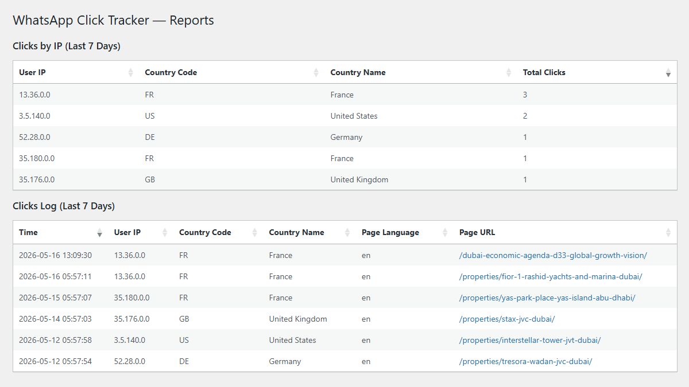
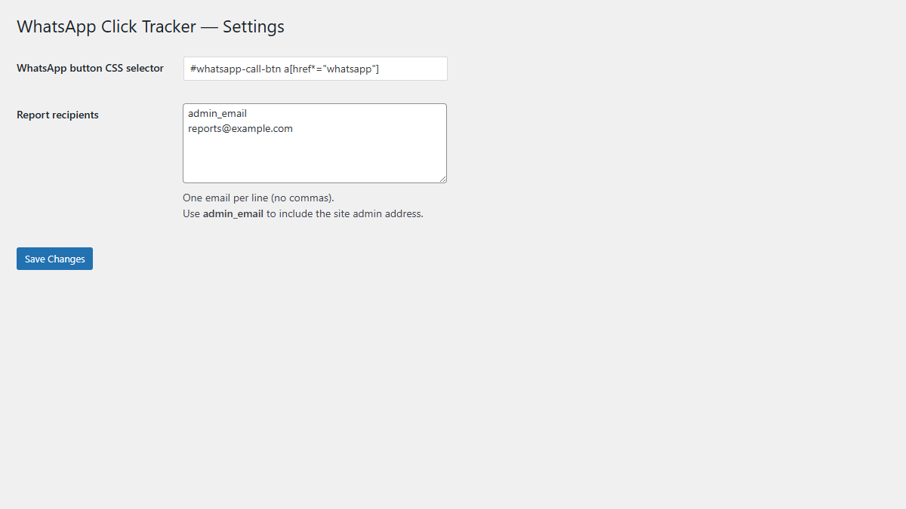
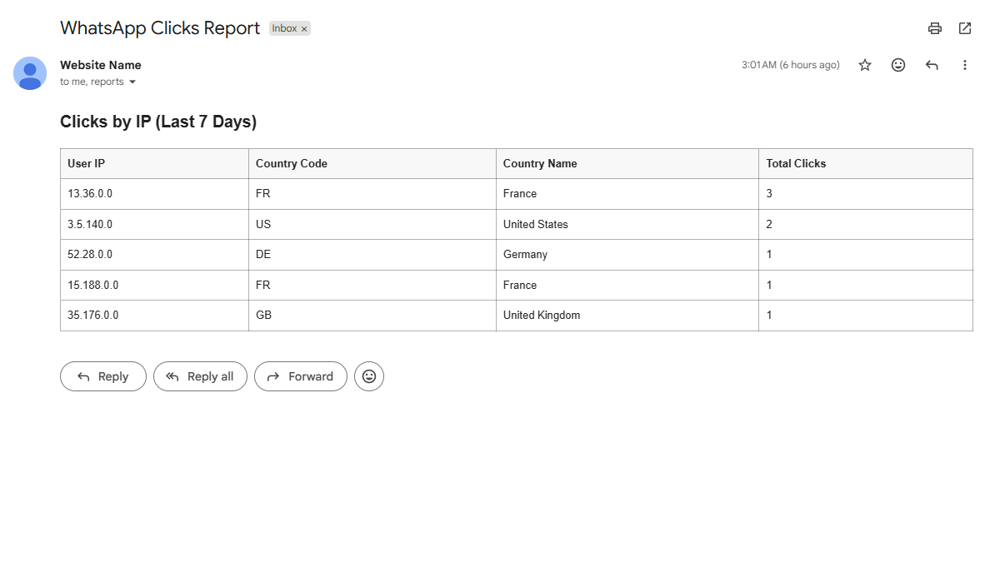

# WhatsApp Click Tracker

A WordPress plugin that tracks WhatsApp button clicks, stores statistics in the database,
and sends weekly email reports.

## Preview

**Reports Page**

<kbd>
  
</kbd>

&nbsp;

**Settings Page**

<kbd>
  
</kbd>

&nbsp;

**Email Report**

<kbd>
  
</kbd>

## Features

* WhatsApp button click tracking
* Statistics stored in a dedicated DB table
* Sortable admin reports
* Weekly email reports
* Configurable CSS selector and recipients list

## How It Works

* Frontend listener captures WhatsApp button clicks
* AJAX endpoint receives and validates requests
* Click data is stored in the database
* Reports are displayed in the admin panel and sent weekly via email

## Technologies

* PHP
* JavaScript
* MySQL
* jQuery DataTables (admin reports)

## Options

| Option              | Description                                                                                                                                        |
|---------------------|----------------------------------------------------------------------------------------------------------------------------------------------------|
| `CSS selector`      | Any valid CSS selector to target your WhatsApp button(s)                                                                                           |
| `Report recipients` | A list of emails that will receive reports One email per line with no commas `admin_email` can be used to include the site admin address |